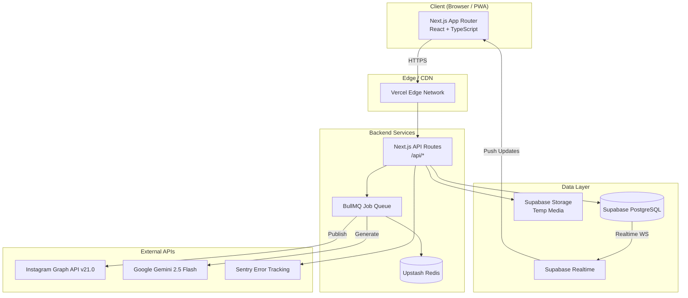
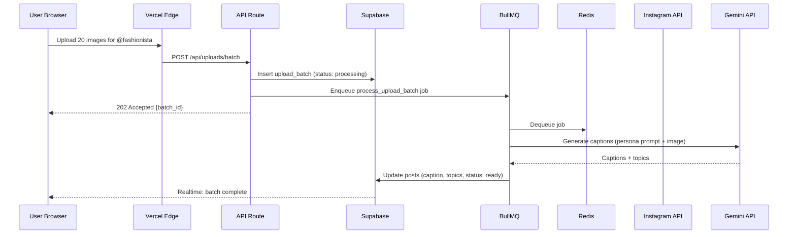
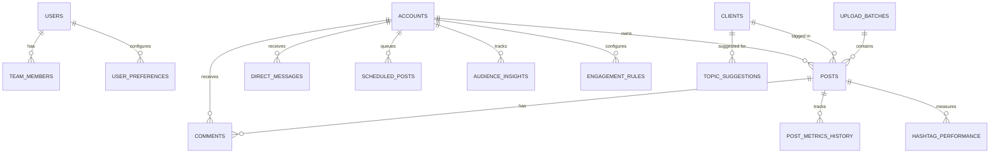
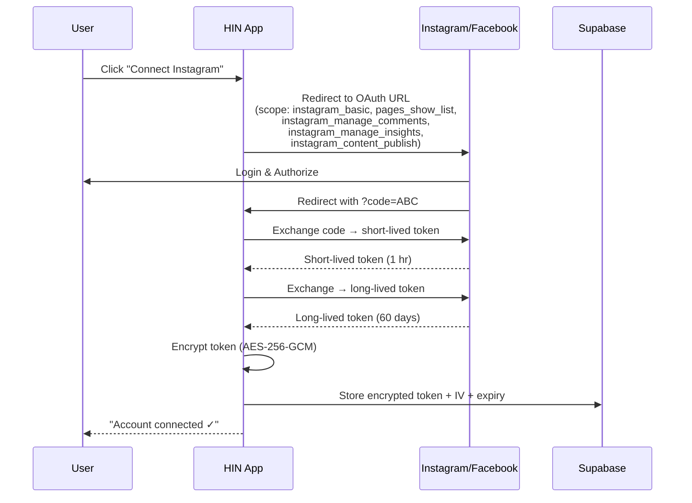
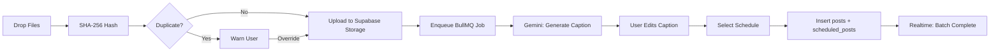
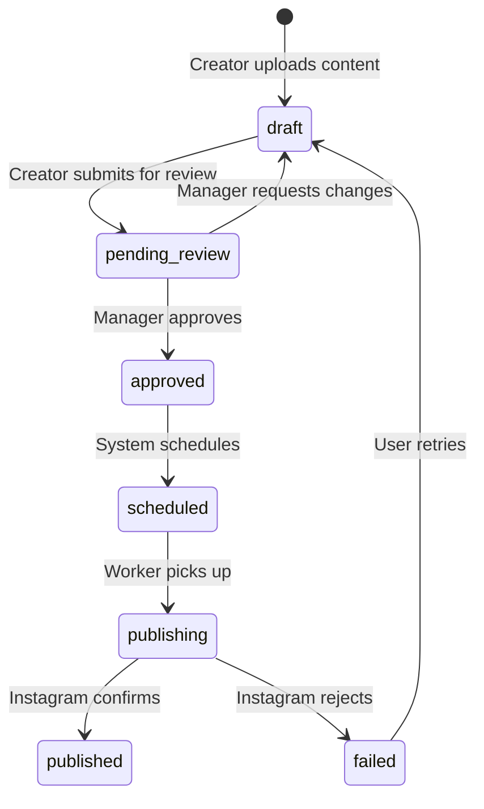
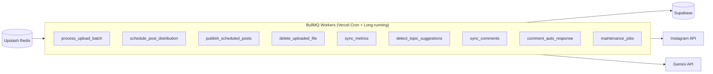
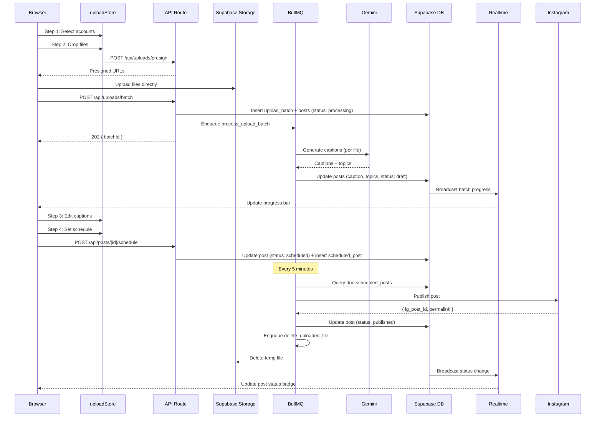
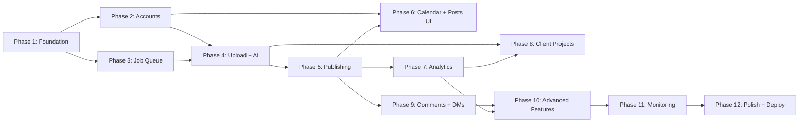

# Helios Influencer Network (HIN) — Master Project Specification

> **Version:** 1.0.0 | **Date:** 2026-03-27 | **Status:** Ready for Implementation  
> **Audience:** Autonomous coding agents (Claude Code / Sonnet one-shot sessions)

---

## Table of Contents

1. [Executive Summary](#1-executive-summary)
2. [Core Architecture](#2-core-architecture)
3. [Technology Stack](#3-technology-stack)
4. [Database Schema](#4-database-schema)
5. [Authentication & Authorization](#5-authentication--authorization)
6. [API Architecture](#6-api-architecture)
7. [Feature Deep Dive](#7-feature-deep-dive)
8. [Background Job System](#8-background-job-system)
9. [AI Integration Specifications](#9-ai-integration-specifications)
10. [State Management & Data Flow](#10-state-management--data-flow)
11. [Security, Rate Limiting & Compliance](#11-security-rate-limiting--compliance)
12. [Storage Strategy](#12-storage-strategy)
13. [Monitoring, Alerting & Observability](#13-monitoring-alerting--observability)
14. [Mobile & PWA Strategy](#14-mobile--pwa-strategy)
15. [Design System](#15-design-system)
16. [Step-by-Step Implementation Roadmap](#16-step-by-step-implementation-roadmap)
17. [Environment Configuration](#17-environment-configuration)
18. [Appendix: Mermaid Diagrams](#18-appendix-mermaid-diagrams)

---

## 1. Executive Summary

### 1.1 The "Why"

Managing dozens of AI-powered Instagram influencer personas is operationally chaotic without tooling. Teams juggle spreadsheets for schedules, browser tabs for posting, and loose threads for brand partnerships. There is no purpose-built platform that unifies **AI content generation** (personality-consistent captions, comment replies) with **professional social-media management** (scheduling, analytics, client reporting, team collaboration).

### 1.2 The "What"

**HIN** is a full-stack SaaS platform — "Sprout Social for AI influencers" — that lets a team:

1. **Manage N influencer accounts** from a single dashboard, each with a distinct AI persona (system prompt, tone, vocabulary).
2. **Bulk-upload media → auto-generate captions** via Google Gemini, respecting each persona's voice.
3. **Schedule, publish, and track** posts through Instagram Graph API with rate-limit-aware automation.
4. **Detect and manage brand partnerships** via an AI topic-detection engine that surfaces recurring themes as "Client Projects."
5. **Respond to comments and DMs** with AI-drafted replies that require human approval before sending.
6. **Deliver analytics and white-label client reports** across accounts, campaigns, and time periods.
7. **Collaborate as a team** with role-based permissions, approval workflows, and audit logging.

### 1.3 Key Differentiators

| Capability | HIN | Generic SMM Tools |
|---|---|---|
| Per-account AI persona (system prompt) | ✅ | ❌ |
| AI caption generation from media | ✅ | ❌ |
| AI comment / DM drafting with approval | ✅ | ❌ |
| Topic-detection → Client Project auto-suggestion | ✅ | ❌ |
| Bulk upload with duplicate detection (SHA-256) | ✅ | Partial |
| White-label client reporting | ✅ | ✅ |

---

## 2. Core Architecture

### 2.1 High-Level System Diagram



### 2.2 Request Flow



### 2.3 Deployment Topology

| Layer | Service | Purpose |
|---|---|---|
| CDN / Edge | Vercel | SSR, API routes, static assets |
| Database | Supabase (PostgreSQL 15+) | Primary data store, RLS, Realtime |
| File Storage | Supabase Storage | Temporary media before Instagram publish |
| Cache / Queue | Upstash Redis | BullMQ job queue, API rate-limit counters, session cache |
| AI | Google Gemini 2.5 Flash | Caption gen, topic detection, comment drafts |
| Social | Instagram Graph API v21.0 | Post publishing, metrics, comments, DMs |
| Monitoring | Sentry | Error tracking, performance tracing |

---

## 3. Technology Stack

### 3.1 Frontend

| Concern | Choice | Rationale |
|---|---|---|
| Framework | **Next.js 16+** (App Router) | Server Components, streaming, built-in API routes |
| Language | **TypeScript 5.7+** | Strict mode, `satisfies`, `using` declarations |
| Styling | **Tailwind CSS 4** | JIT, design-token-first, CSS-in-Tailwind variables |
| Component Library | **shadcn/ui** (Radix primitives) | Accessible, composable, themeable |
| State (client) | **Zustand 5** | Lightweight, middleware-friendly, devtools |
| Server State | **TanStack Query v6** (React Query) | Cache, dedup, optimistic updates, polling |
| Charts | **Recharts 3** | Composable, responsive, SSR-safe |
| Forms | **React Hook Form + Zod** | Validation collocated with schema |
| DnD | **@dnd-kit** | Calendar drag-to-reschedule, upload reorder |
| Date Handling | **date-fns 4** | Tree-shakeable, timezone-aware via `date-fns-tz` |

### 3.2 Backend

| Concern | Choice | Rationale |
|---|---|---|
| Runtime | **Node.js 22 LTS** | V8 latest, native `fetch`, `using` support |
| API Layer | Next.js Route Handlers (`/app/api/`) | Co-located, edge-optional, type-safe |
| Database | **Supabase** (PostgreSQL 16) | Managed Postgres, RLS, Realtime, Storage, Auth |
| Job Queue | **BullMQ 5** | Delayed, cron, retry, rate-limiter, concurrency |
| Redis | **Upstash Redis** (serverless) | Pay-per-request, global edge, BullMQ-compatible |
| Encryption | **Node.js `crypto`** | AES-256-GCM for token encryption |
| Validation | **Zod 3.24+** | Shared schemas between client & server |

### 3.3 External Services

| Service | Version / Tier | Key Limits |
|---|---|---|
| Instagram Graph API | **v21.0** | 200 calls/hour/token, 25 media posts/day |
| Google Gemini | **2.5 Flash** | 1,500 RPM free tier / 4,000 RPM paid |
| Supabase | **Pro plan** | 8 GB DB, 250 GB storage, 50 GB bandwidth |
| Upstash Redis | **Pay-as-you-go** | 10,000 commands/day free, then $0.2/100k |
| Vercel | **Pro plan** | 1,000 GB bandwidth, serverless functions |
| Sentry | **Team plan** | 50k events/mo |

---

## 4. Database Schema

### 4.1 Entity-Relationship Diagram



### 4.2 Complete Table Definitions

All tables include implicit Supabase-managed `id` (UUID, PK, default `gen_random_uuid()`) unless noted. All timestamps are `timestamptz`.

---

#### `users` (Supabase Auth — extended via `auth.users`)

Managed by Supabase Auth. Extended profile data stored in a public `profiles` table.

```sql
CREATE TABLE public.profiles (
    id              UUID PRIMARY KEY REFERENCES auth.users(id) ON DELETE CASCADE,
    full_name       TEXT NOT NULL,
    avatar_url      TEXT,
    role            TEXT NOT NULL DEFAULT 'viewer'
                        CHECK (role IN ('admin','manager','creator','viewer')),
    created_at      TIMESTAMPTZ NOT NULL DEFAULT now(),
    updated_at      TIMESTAMPTZ NOT NULL DEFAULT now()
);
```

---

#### `accounts` — Influencer Personas

```sql
CREATE TABLE public.accounts (
    id                  UUID PRIMARY KEY DEFAULT gen_random_uuid(),
    user_id             UUID NOT NULL REFERENCES auth.users(id) ON DELETE CASCADE,
    instagram_user_id   TEXT UNIQUE,                -- IG numeric user ID
    instagram_username  TEXT,                        -- @handle
    display_name        TEXT NOT NULL,               -- Friendly label
    avatar_url          TEXT,
    system_prompt       TEXT NOT NULL DEFAULT '',     -- AI persona definition
    tone_keywords       TEXT[] DEFAULT '{}',          -- e.g. {"witty","sarcastic","empowering"}
    bio                 TEXT,
    
    -- Instagram OAuth
    access_token_enc    TEXT,                         -- AES-256-GCM encrypted
    token_iv            TEXT,                         -- Initialization vector (hex)
    token_expires_at    TIMESTAMPTZ,
    token_refresh_at    TIMESTAMPTZ,                  -- Last refresh timestamp
    
    -- Posting configuration
    posting_schedule    JSONB NOT NULL DEFAULT '{"times":["09:00","12:00","18:00"],"timezone":"UTC","max_per_day":3}',
    is_active           BOOLEAN NOT NULL DEFAULT true,
    
    -- Health
    last_api_check      TIMESTAMPTZ,
    api_status          TEXT DEFAULT 'unknown'
                            CHECK (api_status IN ('healthy','degraded','error','unknown')),
    error_message       TEXT,
    
    created_at          TIMESTAMPTZ NOT NULL DEFAULT now(),
    updated_at          TIMESTAMPTZ NOT NULL DEFAULT now()
);

CREATE INDEX idx_accounts_user ON accounts(user_id);
CREATE INDEX idx_accounts_ig_user ON accounts(instagram_user_id);
```

---

#### `posts` — Content Lifecycle

```sql
CREATE TABLE public.posts (
    id                  UUID PRIMARY KEY DEFAULT gen_random_uuid(),
    account_id          UUID NOT NULL REFERENCES accounts(id) ON DELETE CASCADE,
    upload_batch_id     UUID REFERENCES upload_batches(id) ON DELETE SET NULL,
    client_id           UUID REFERENCES clients(id) ON DELETE SET NULL,
    assigned_to         UUID REFERENCES auth.users(id) ON DELETE SET NULL,
    
    -- Content
    media_type          TEXT NOT NULL CHECK (media_type IN ('image','video','carousel','reel')),
    media_urls          TEXT[] NOT NULL DEFAULT '{}',           -- Supabase Storage paths (pre-publish) or IG CDN URLs (post-publish)
    media_hash          TEXT,                                    -- SHA-256 of primary file for dedup
    thumbnail_url       TEXT,
    caption             TEXT NOT NULL DEFAULT '',
    hashtags            TEXT[] DEFAULT '{}',
    detected_topics     TEXT[] DEFAULT '{}',                     -- Gemini-extracted topics
    alt_text            TEXT,
    location_tag        TEXT,
    
    -- Lifecycle
    status              TEXT NOT NULL DEFAULT 'draft'
                            CHECK (status IN ('draft','pending_review','approved','scheduled','publishing','published','failed','archived')),
    failure_reason      TEXT,
    retry_count         INT NOT NULL DEFAULT 0,
    
    -- Instagram metadata (post-publish)
    instagram_post_id   TEXT,
    instagram_permalink TEXT,
    published_at        TIMESTAMPTZ,
    
    -- Metrics snapshot (denormalized for fast reads)
    likes_count         INT DEFAULT 0,
    comments_count      INT DEFAULT 0,
    reach               INT DEFAULT 0,
    impressions         INT DEFAULT 0,
    saves               INT DEFAULT 0,
    shares              INT DEFAULT 0,
    engagement_rate     NUMERIC(5,4) DEFAULT 0,                  -- e.g. 0.0342 = 3.42%
    
    -- Scheduling
    scheduled_at        TIMESTAMPTZ,
    
    created_at          TIMESTAMPTZ NOT NULL DEFAULT now(),
    updated_at          TIMESTAMPTZ NOT NULL DEFAULT now()
);

CREATE INDEX idx_posts_account ON posts(account_id);
CREATE INDEX idx_posts_status ON posts(status);
CREATE INDEX idx_posts_scheduled ON posts(scheduled_at) WHERE status = 'scheduled';
CREATE INDEX idx_posts_client ON posts(client_id);
CREATE INDEX idx_posts_hash ON posts(media_hash);
CREATE INDEX idx_posts_published ON posts(published_at DESC);
```

---

#### `upload_batches` — Bulk Upload Tracking

```sql
CREATE TABLE public.upload_batches (
    id              UUID PRIMARY KEY DEFAULT gen_random_uuid(),
    account_id      UUID NOT NULL REFERENCES accounts(id) ON DELETE CASCADE,
    uploaded_by     UUID NOT NULL REFERENCES auth.users(id),
    
    status          TEXT NOT NULL DEFAULT 'pending'
                        CHECK (status IN ('pending','processing','caption_generation','scheduling','completed','partial_failure','failed')),
    total_files     INT NOT NULL DEFAULT 0,
    processed_files INT NOT NULL DEFAULT 0,
    failed_files    INT NOT NULL DEFAULT 0,
    error_log       JSONB DEFAULT '[]',               -- [{file: "img1.jpg", error: "..."}]
    
    created_at      TIMESTAMPTZ NOT NULL DEFAULT now(),
    updated_at      TIMESTAMPTZ NOT NULL DEFAULT now()
);
```

---

#### `clients` — Brand / Client Projects

```sql
CREATE TABLE public.clients (
    id                  UUID PRIMARY KEY DEFAULT gen_random_uuid(),
    user_id             UUID NOT NULL REFERENCES auth.users(id) ON DELETE CASCADE,
    name                TEXT NOT NULL,
    logo_url            TEXT,
    contact_email       TEXT,
    
    -- Topic matching
    topic_keywords      TEXT[] NOT NULL DEFAULT '{}',    -- e.g. {"skincare","sunscreen","SPF"}
    hashtag_tracking    TEXT[] DEFAULT '{}',              -- Brand hashtags to track
    
    -- Campaign
    campaign_name       TEXT,
    campaign_start      DATE,
    campaign_end        DATE,
    campaign_budget     NUMERIC(12,2),
    campaign_goals      JSONB DEFAULT '{}',              -- {"posts": 10, "min_reach": 50000}
    
    -- Status
    is_active           BOOLEAN NOT NULL DEFAULT true,
    auto_suggested      BOOLEAN NOT NULL DEFAULT false,   -- Created via topic detection
    
    created_at          TIMESTAMPTZ NOT NULL DEFAULT now(),
    updated_at          TIMESTAMPTZ NOT NULL DEFAULT now()
);

CREATE INDEX idx_clients_user ON clients(user_id);
CREATE INDEX idx_clients_keywords ON clients USING GIN(topic_keywords);
```

---

#### `comments` — Instagram Comment Management

```sql
CREATE TABLE public.comments (
    id                  UUID PRIMARY KEY DEFAULT gen_random_uuid(),
    post_id             UUID NOT NULL REFERENCES posts(id) ON DELETE CASCADE,
    account_id          UUID NOT NULL REFERENCES accounts(id) ON DELETE CASCADE,
    
    instagram_comment_id TEXT UNIQUE,
    parent_comment_id    UUID REFERENCES comments(id) ON DELETE CASCADE,  -- Thread support
    
    author_username     TEXT NOT NULL,
    author_ig_id        TEXT,
    body                TEXT NOT NULL,
    
    -- AI processing
    sentiment           TEXT CHECK (sentiment IN ('positive','neutral','negative','spam')),
    priority_score      INT DEFAULT 0 CHECK (priority_score BETWEEN 0 AND 100),
    is_business_inquiry BOOLEAN DEFAULT false,
    detected_intent     TEXT,                           -- e.g. "collaboration_request", "complaint"
    
    -- Response
    ai_response_draft   TEXT,
    response_status     TEXT DEFAULT 'unread'
                            CHECK (response_status IN ('unread','ai_drafted','approved','sent','ignored','spam')),
    responded_by        UUID REFERENCES auth.users(id),
    responded_at        TIMESTAMPTZ,
    
    created_at          TIMESTAMPTZ NOT NULL DEFAULT now(),
    synced_at           TIMESTAMPTZ NOT NULL DEFAULT now()
);

CREATE INDEX idx_comments_post ON comments(post_id);
CREATE INDEX idx_comments_account ON comments(account_id);
CREATE INDEX idx_comments_status ON comments(response_status);
CREATE INDEX idx_comments_priority ON comments(priority_score DESC);
```

---

#### `direct_messages` — DM Management

```sql
CREATE TABLE public.direct_messages (
    id                  UUID PRIMARY KEY DEFAULT gen_random_uuid(),
    account_id          UUID NOT NULL REFERENCES accounts(id) ON DELETE CASCADE,
    
    instagram_thread_id TEXT,
    instagram_msg_id    TEXT UNIQUE,
    
    sender_username     TEXT NOT NULL,
    sender_ig_id        TEXT,
    direction           TEXT NOT NULL CHECK (direction IN ('inbound','outbound')),
    body                TEXT NOT NULL,
    media_url           TEXT,
    
    -- AI processing
    sentiment           TEXT CHECK (sentiment IN ('positive','neutral','negative','spam')),
    priority_score      INT DEFAULT 0 CHECK (priority_score BETWEEN 0 AND 100),
    is_business_inquiry BOOLEAN DEFAULT false,
    
    -- Response
    ai_response_draft   TEXT,
    response_status     TEXT DEFAULT 'unread'
                            CHECK (response_status IN ('unread','ai_drafted','approved','sent','ignored','spam')),
    responded_by        UUID REFERENCES auth.users(id),
    responded_at        TIMESTAMPTZ,
    
    read_at             TIMESTAMPTZ,
    created_at          TIMESTAMPTZ NOT NULL DEFAULT now()
);

CREATE INDEX idx_dms_account ON direct_messages(account_id);
CREATE INDEX idx_dms_thread ON direct_messages(instagram_thread_id);
CREATE INDEX idx_dms_status ON direct_messages(response_status);
```

---

#### `post_metrics_history` — Time-Series Analytics

```sql
CREATE TABLE public.post_metrics_history (
    id              UUID PRIMARY KEY DEFAULT gen_random_uuid(),
    post_id         UUID NOT NULL REFERENCES posts(id) ON DELETE CASCADE,
    
    likes           INT NOT NULL DEFAULT 0,
    comments        INT NOT NULL DEFAULT 0,
    reach           INT NOT NULL DEFAULT 0,
    impressions     INT NOT NULL DEFAULT 0,
    saves           INT NOT NULL DEFAULT 0,
    shares          INT NOT NULL DEFAULT 0,
    engagement_rate NUMERIC(5,4) DEFAULT 0,
    
    recorded_at     TIMESTAMPTZ NOT NULL DEFAULT now()
);

CREATE INDEX idx_metrics_post ON post_metrics_history(post_id, recorded_at DESC);
```

---

#### `topic_suggestions` — AI-Detected Client Opportunities

```sql
CREATE TABLE public.topic_suggestions (
    id              UUID PRIMARY KEY DEFAULT gen_random_uuid(),
    user_id         UUID NOT NULL REFERENCES auth.users(id) ON DELETE CASCADE,
    
    topic           TEXT NOT NULL,
    frequency       INT NOT NULL DEFAULT 0,             -- Occurrences in detection window
    sample_post_ids UUID[] DEFAULT '{}',                -- Example posts containing topic
    suggested_keywords TEXT[] DEFAULT '{}',
    
    status          TEXT NOT NULL DEFAULT 'pending'
                        CHECK (status IN ('pending','accepted','dismissed')),
    client_id       UUID REFERENCES clients(id),        -- Set if accepted → created project
    
    detected_at     TIMESTAMPTZ NOT NULL DEFAULT now(),
    expires_at      TIMESTAMPTZ NOT NULL DEFAULT (now() + INTERVAL '30 days')
);

CREATE INDEX idx_suggestions_user ON topic_suggestions(user_id, status);
```

---

#### `team_members` — Multi-User Collaboration

```sql
CREATE TABLE public.team_members (
    id              UUID PRIMARY KEY DEFAULT gen_random_uuid(),
    team_owner_id   UUID NOT NULL REFERENCES auth.users(id) ON DELETE CASCADE,
    user_id         UUID NOT NULL REFERENCES auth.users(id) ON DELETE CASCADE,
    
    role            TEXT NOT NULL DEFAULT 'viewer'
                        CHECK (role IN ('admin','manager','creator','viewer')),
    invited_email   TEXT,
    invite_status   TEXT NOT NULL DEFAULT 'pending'
                        CHECK (invite_status IN ('pending','accepted','revoked')),
    permissions     JSONB DEFAULT '{"accounts":[],"can_publish":false,"can_delete":false}',
    
    invited_at      TIMESTAMPTZ NOT NULL DEFAULT now(),
    accepted_at     TIMESTAMPTZ,
    
    UNIQUE(team_owner_id, user_id)
);
```

---

#### `job_logs` — Background Job Monitoring

```sql
CREATE TABLE public.job_logs (
    id              UUID PRIMARY KEY DEFAULT gen_random_uuid(),
    job_name        TEXT NOT NULL,
    job_id          TEXT,                                 -- BullMQ job ID
    status          TEXT NOT NULL CHECK (status IN ('started','completed','failed','retrying')),
    payload         JSONB DEFAULT '{}',
    result          JSONB DEFAULT '{}',
    error_message   TEXT,
    duration_ms     INT,
    started_at      TIMESTAMPTZ NOT NULL DEFAULT now(),
    completed_at    TIMESTAMPTZ
);

CREATE INDEX idx_job_logs_name ON job_logs(job_name, started_at DESC);
CREATE INDEX idx_job_logs_status ON job_logs(status) WHERE status = 'failed';
```

---

#### `api_health_logs` — External API Monitoring

```sql
CREATE TABLE public.api_health_logs (
    id              UUID PRIMARY KEY DEFAULT gen_random_uuid(),
    service         TEXT NOT NULL CHECK (service IN ('instagram','gemini','supabase','redis')),
    endpoint        TEXT,
    status_code     INT,
    response_time_ms INT,
    is_healthy      BOOLEAN NOT NULL DEFAULT true,
    error_message   TEXT,
    checked_at      TIMESTAMPTZ NOT NULL DEFAULT now()
);

CREATE INDEX idx_api_health_service ON api_health_logs(service, checked_at DESC);
```

---

#### `user_preferences` — Notification & UI Settings

```sql
CREATE TABLE public.user_preferences (
    id              UUID PRIMARY KEY DEFAULT gen_random_uuid(),
    user_id         UUID NOT NULL UNIQUE REFERENCES auth.users(id) ON DELETE CASCADE,
    
    -- Notifications
    email_notifications     BOOLEAN DEFAULT true,
    push_notifications      BOOLEAN DEFAULT true,
    notify_new_comments     BOOLEAN DEFAULT true,
    notify_new_dms          BOOLEAN DEFAULT true,
    notify_post_published   BOOLEAN DEFAULT true,
    notify_post_failed      BOOLEAN DEFAULT true,
    notify_topic_suggestion BOOLEAN DEFAULT true,
    notify_team_activity    BOOLEAN DEFAULT true,
    
    -- UI
    default_calendar_view   TEXT DEFAULT 'month' CHECK (default_calendar_view IN ('month','week')),
    sidebar_collapsed       BOOLEAN DEFAULT false,
    theme                   TEXT DEFAULT 'light' CHECK (theme IN ('light','dark','system')),
    timezone                TEXT DEFAULT 'UTC',
    
    created_at              TIMESTAMPTZ NOT NULL DEFAULT now(),
    updated_at              TIMESTAMPTZ NOT NULL DEFAULT now()
);
```

---

#### `hashtag_performance` — Tag Analytics

```sql
CREATE TABLE public.hashtag_performance (
    id              UUID PRIMARY KEY DEFAULT gen_random_uuid(),
    account_id      UUID NOT NULL REFERENCES accounts(id) ON DELETE CASCADE,
    hashtag         TEXT NOT NULL,
    
    times_used      INT NOT NULL DEFAULT 0,
    avg_reach       NUMERIC(10,2) DEFAULT 0,
    avg_engagement  NUMERIC(5,4) DEFAULT 0,
    last_used_at    TIMESTAMPTZ,
    
    calculated_at   TIMESTAMPTZ NOT NULL DEFAULT now(),
    
    UNIQUE(account_id, hashtag)
);

CREATE INDEX idx_hashtag_account ON hashtag_performance(account_id);
```

---

#### `audience_insights` — Follower Demographics

```sql
CREATE TABLE public.audience_insights (
    id              UUID PRIMARY KEY DEFAULT gen_random_uuid(),
    account_id      UUID NOT NULL REFERENCES accounts(id) ON DELETE CASCADE,
    
    follower_count  INT DEFAULT 0,
    following_count INT DEFAULT 0,
    
    -- Demographics (from IG Insights API)
    age_ranges      JSONB DEFAULT '{}',       -- {"18-24": 0.32, "25-34": 0.45, ...}
    gender_split    JSONB DEFAULT '{}',       -- {"male": 0.4, "female": 0.55, "other": 0.05}
    top_cities      JSONB DEFAULT '[]',       -- [{"city":"LA","pct":0.12}, ...]
    top_countries   JSONB DEFAULT '[]',       -- [{"country":"US","pct":0.65}, ...]
    
    -- Activity patterns
    active_hours    JSONB DEFAULT '{}',       -- {"0":120,"1":80,...,"23":200}  (follower activity count per hour)
    active_days     JSONB DEFAULT '{}',       -- {"mon":1500,"tue":1800,...}
    
    recorded_at     TIMESTAMPTZ NOT NULL DEFAULT now()
);

CREATE INDEX idx_audience_account ON audience_insights(account_id, recorded_at DESC);
```

---

#### `scheduled_posts` — Publishing Queue

> **Design Decision:** Scheduling metadata lives directly on the `posts` table (`scheduled_at`, `status = 'scheduled'`). This table is **kept as a denormalized job-queue view** used exclusively by the `publish_scheduled_posts` worker to avoid heavy queries on the main `posts` table.

```sql
CREATE TABLE public.scheduled_posts (
    id              UUID PRIMARY KEY DEFAULT gen_random_uuid(),
    post_id         UUID NOT NULL UNIQUE REFERENCES posts(id) ON DELETE CASCADE,
    account_id      UUID NOT NULL REFERENCES accounts(id) ON DELETE CASCADE,
    
    scheduled_at    TIMESTAMPTZ NOT NULL,
    priority        INT NOT NULL DEFAULT 0,               -- Higher = publish first in same window
    
    picked_up       BOOLEAN NOT NULL DEFAULT false,       -- Claimed by worker
    picked_up_at    TIMESTAMPTZ,
    
    created_at      TIMESTAMPTZ NOT NULL DEFAULT now()
);

CREATE INDEX idx_scheduled_pending ON scheduled_posts(scheduled_at)
    WHERE picked_up = false;
```

---

#### `engagement_rules` — Automated Response Config

```sql
CREATE TABLE public.engagement_rules (
    id              UUID PRIMARY KEY DEFAULT gen_random_uuid(),
    account_id      UUID NOT NULL REFERENCES accounts(id) ON DELETE CASCADE,
    
    rule_name       TEXT NOT NULL,
    trigger_type    TEXT NOT NULL CHECK (trigger_type IN ('keyword','sentiment','follower_count','is_verified','is_business')),
    trigger_value   TEXT NOT NULL,                         -- e.g. "collab" for keyword trigger
    
    action          TEXT NOT NULL CHECK (action IN ('auto_draft','flag_priority','notify_team','ignore')),
    response_template TEXT,                                -- Optional template for auto_draft
    
    is_active       BOOLEAN NOT NULL DEFAULT true,
    priority        INT NOT NULL DEFAULT 0,
    
    created_at      TIMESTAMPTZ NOT NULL DEFAULT now()
);

CREATE INDEX idx_rules_account ON engagement_rules(account_id, is_active);
```

### 4.3 Database Functions & Triggers

```sql
-- Auto-update `updated_at` on every row change
CREATE OR REPLACE FUNCTION update_updated_at()
RETURNS TRIGGER AS $$
BEGIN
    NEW.updated_at = now();
    RETURN NEW;
END;
$$ LANGUAGE plpgsql;

-- Apply to all tables with updated_at
DO $$
DECLARE t TEXT;
BEGIN
    FOR t IN
        SELECT table_name FROM information_schema.columns
        WHERE column_name = 'updated_at' AND table_schema = 'public'
    LOOP
        EXECUTE format(
            'CREATE TRIGGER trg_%I_updated_at BEFORE UPDATE ON %I
             FOR EACH ROW EXECUTE FUNCTION update_updated_at()',
            t, t
        );
    END LOOP;
END;
$$;

-- Engagement rate calculation helper
CREATE OR REPLACE FUNCTION calc_engagement_rate(
    p_likes INT, p_comments INT, p_saves INT, p_shares INT, p_reach INT
) RETURNS NUMERIC AS $$
BEGIN
    IF p_reach = 0 THEN RETURN 0; END IF;
    RETURN ROUND(((p_likes + p_comments + p_saves + p_shares)::NUMERIC / p_reach), 4);
END;
$$ LANGUAGE plpgsql IMMUTABLE;
```

---

## 5. Authentication & Authorization

### 5.1 Auth Provider

**Supabase Auth** with the following providers:

| Method | Config |
|---|---|
| Email/Password | Default. Email confirmation required. |
| Magic Link | Optional passwordless login. |
| Google OAuth | Social sign-in for team invites. |

### 5.2 Role Hierarchy

```
admin > manager > creator > viewer
```

| Permission | Admin | Manager | Creator | Viewer |
|---|---|---|---|---|
| View dashboard & analytics | ✅ | ✅ | ✅ | ✅ |
| Upload & draft content | ✅ | ✅ | ✅ | ❌ |
| Edit others' drafts | ✅ | ✅ | ❌ | ❌ |
| Approve & publish posts | ✅ | ✅ | ❌ | ❌ |
| Manage accounts & tokens | ✅ | ❌ | ❌ | ❌ |
| Manage team & billing | ✅ | ❌ | ❌ | ❌ |
| Approve AI comment replies | ✅ | ✅ | ❌ | ❌ |
| Delete published posts | ✅ | ❌ | ❌ | ❌ |
| Manage client projects | ✅ | ✅ | ❌ | ❌ |

### 5.3 Row-Level Security (RLS) Policies

Every public table has RLS **enabled**. Policies follow this pattern:

```sql
-- Example: accounts table
ALTER TABLE public.accounts ENABLE ROW LEVEL SECURITY;

-- Owner access
CREATE POLICY "accounts_owner" ON accounts
    FOR ALL USING (
        user_id = auth.uid()
    );

-- Team member read access
CREATE POLICY "accounts_team_read" ON accounts
    FOR SELECT USING (
        EXISTS (
            SELECT 1 FROM team_members tm
            WHERE tm.team_owner_id = accounts.user_id
            AND tm.user_id = auth.uid()
            AND tm.invite_status = 'accepted'
        )
    );

-- Team member write (manager+)
CREATE POLICY "accounts_team_write" ON accounts
    FOR UPDATE USING (
        EXISTS (
            SELECT 1 FROM team_members tm
            WHERE tm.team_owner_id = accounts.user_id
            AND tm.user_id = auth.uid()
            AND tm.invite_status = 'accepted'
            AND tm.role IN ('admin','manager')
        )
    );
```

> **Implementation note:** Apply equivalent policies to all 14 tables. Posts, comments, DMs, etc. cascade through `account_id → accounts.user_id` for ownership checks.

### 5.4 Instagram OAuth Flow



**Token Refresh Strategy:**

- Long-lived tokens last 60 days.
- A cron job (`token_refresh`) runs **daily** and refreshes any token expiring within **7 days**.
- On refresh failure (3 retries), set `api_status = 'error'` and alert the user.

---

## 6. API Architecture

### 6.1 Route Structure

All routes under `/app/api/`. Auth middleware applied globally via `middleware.ts`.

```
/api
├── auth/
│   ├── callback/           POST    Instagram OAuth callback
│   └── session/            GET     Current session info
│
├── accounts/
│   ├── route.ts            GET     List accounts | POST Create account
│   └── [id]/
│       ├── route.ts        GET|PATCH|DELETE  Account CRUD
│       ├── connect/        POST    Initiate Instagram OAuth
│       ├── disconnect/     POST    Revoke token & disconnect
│       ├── health/         GET     Token & API health check
│       └── insights/       GET     Audience insights
│
├── posts/
│   ├── route.ts            GET     List posts (filterable) | POST Create post
│   └── [id]/
│       ├── route.ts        GET|PATCH|DELETE  Post CRUD
│       ├── publish/        POST    Immediate publish
│       ├── schedule/       POST    Schedule post
│       ├── duplicate/      POST    Clone to another account
│       └── metrics/        GET     Metrics history
│
├── uploads/
│   ├── batch/              POST    Start bulk upload
│   ├── [batchId]/
│   │   ├── status/         GET     Batch progress (also via Realtime)
│   │   └── retry/          POST    Retry failed items
│   └── presign/            POST    Get presigned upload URL
│
├── calendar/
│   ├── route.ts            GET     Calendar events (date range + account filter)
│   └── reschedule/         PATCH   Drag-drop reschedule
│
├── clients/
│   ├── route.ts            GET|POST
│   └── [id]/
│       ├── route.ts        GET|PATCH|DELETE
│       ├── posts/          GET     Posts tagged to client
│       └── report/         GET     Generate client report
│
├── comments/
│   ├── route.ts            GET     Unified inbox
│   ├── [id]/
│   │   ├── approve/        POST    Approve AI draft → send
│   │   ├── edit/           PATCH   Edit AI draft before send
│   │   └── ignore/         POST    Mark as ignored/spam
│   └── bulk/               POST    Bulk actions
│
├── dms/
│   ├── route.ts            GET     DM inbox
│   └── [id]/
│       ├── approve/        POST
│       └── reply/          POST    Manual reply
│
├── analytics/
│   ├── overview/           GET     Dashboard metrics
│   ├── accounts/[id]/      GET     Account-level analytics
│   ├── clients/[id]/       GET     Client project analytics
│   └── export/             POST    Generate report (PDF/CSV)
│
├── suggestions/
│   ├── route.ts            GET     Pending topic suggestions
│   └── [id]/
│       ├── accept/         POST    Create client from suggestion
│       └── dismiss/        POST    Dismiss suggestion
│
├── team/
│   ├── route.ts            GET|POST  List/Invite members
│   └── [id]/
│       ├── route.ts        PATCH|DELETE  Update/Remove member
│       └── permissions/    PATCH   Update granular permissions
│
├── settings/
│   ├── preferences/        GET|PATCH
│   └── security/           GET|PATCH
│
└── webhooks/
    └── instagram/          POST    Instagram webhook receiver
```

### 6.2 Standard API Response Envelope

```typescript
// Success
interface ApiSuccess<T> {
  ok: true;
  data: T;
  meta?: {
    page: number;
    per_page: number;
    total: number;
    total_pages: number;
  };
}

// Error
interface ApiError {
  ok: false;
  error: {
    code: string;         // Machine-readable: "RATE_LIMIT_EXCEEDED"
    message: string;      // Human-readable
    details?: unknown;    // Validation errors, etc.
  };
}

// Common error codes
type ErrorCode =
  | 'UNAUTHORIZED'
  | 'FORBIDDEN'
  | 'NOT_FOUND'
  | 'VALIDATION_ERROR'
  | 'RATE_LIMIT_EXCEEDED'
  | 'INSTAGRAM_API_ERROR'
  | 'GEMINI_API_ERROR'
  | 'TOKEN_EXPIRED'
  | 'DUPLICATE_CONTENT'
  | 'BATCH_PROCESSING'
  | 'INTERNAL_ERROR';
```

### 6.3 Rate Limiting Strategy

```typescript
// Implemented via Upstash Redis rate limiter (@upstash/ratelimit)
const rateLimits = {
  // Per-user API limits
  api_general:        { window: '1m', max: 60 },
  api_upload:         { window: '1h', max: 100 },
  api_ai_generation:  { window: '1m', max: 20 },

  // Per-account Instagram limits (stricter)
  instagram_publish:  { window: '1h', max: 25 },     // IG limit: 25 posts/day
  instagram_read:     { window: '1h', max: 200 },    // IG limit: 200 calls/hr/token
  instagram_comment:  { window: '1h', max: 60 },
};
```

---

## 7. Feature Deep Dive

Each feature section defines: **Pages/Components → User Stories → Happy Path → Failure States → Key Implementation Details.**

---

### 7.1 Dashboard (Route: `/`)

#### Components

| Component | Description |
|---|---|
| `MetricCards` | 4-card grid: Posts This Week, Avg Engagement Rate, Total Follower Growth, Pending Approvals |
| `PerformanceTrend` | Recharts area chart — engagement over last 30 days (toggleable per account) |
| `TopContentGrid` | Top 6 posts by engagement rate with thumbnails |
| `RecentActivityFeed` | Time-ordered feed: latest posts, comments, DMs, team actions |
| `TopicSuggestionBanner` | Dismissible alert when AI detects a recurring topic |
| `AccountStatusGrid` | Grid of connected accounts with health badge (green/yellow/red) |
| `QuickActions` | FAB or button row: Upload Content, Schedule Post, View Inbox |

#### Happy Path

1. User logs in → Dashboard loads with skeleton loaders.
2. TanStack Query fetches `/api/analytics/overview` (30s stale time).
3. Metric cards animate in. Chart renders with 30-day default.
4. If pending topic suggestions exist → `TopicSuggestionBanner` slides in.
5. User clicks "Upload Content" → Upload modal opens.

#### Failure States

| Scenario | Behavior |
|---|---|
| No accounts connected | Show empty state with CTA: "Connect your first Instagram account" |
| Instagram token expired on 1+ accounts | `AccountStatusGrid` shows red badge with tooltip. Banner: "1 account needs reconnection" |
| Analytics API fails | Show cached data with subtle "Last updated 2h ago" indicator |
| Zero posts this week | Metric card shows "0" with encouraging message, not an error |

---

### 7.2 Content Upload System (4-Step Modal)

#### Route: Modal overlay triggered from any page

#### Step 1: Account Selection

- Display all active accounts as selectable cards (avatar, @handle, posting schedule summary).
- Allow multi-account selection for cross-posting (creates separate post records per account).
- Show each account's remaining daily post capacity.
- **Failure:** No active accounts → redirect to Account Management.

#### Step 2: File Upload

- Drag-and-drop zone + file browser fallback.
- Accepted formats: JPEG, PNG, WebP, MP4, MOV (max 50 MB per file, max 30 files per batch).
- On drop: generate SHA-256 hash → query `posts.media_hash` for duplicates.
- Show preview thumbnails with file size, dimensions, and media type detection.
- Upload to Supabase Storage via presigned URL (chunked for >10 MB).
- **Failure: Duplicate detected** → warning overlay: "This image was posted to @account on Jan 5. Upload anyway?" (Allow / Skip).
- **Failure: Invalid format** → reject with message, keep other files.
- **Failure: Upload fails** → retry button per file, continue with successful uploads.

#### Step 3: Caption Generation & Editing

- For each uploaded file, trigger Gemini caption generation:
  - Input: image/video + account's `system_prompt` + `tone_keywords`.
  - Output: caption text + `detected_topics[]` + suggested hashtags.
- Display in an editable card per file:
  - AI-generated caption (editable `<textarea>`).
  - Hashtag pills (add/remove).
  - Client project assignment dropdown (auto-populated if topics match a client's `topic_keywords`).
  - "Regenerate" button to re-run Gemini with tweaked instructions.
- **Failure: Gemini API error** → show fallback: empty caption with "AI generation unavailable — please write manually" and retry button.
- **Failure: Gemini rate limit** → queue remaining captions, show progress bar.

#### Step 4: Scheduling

Four scheduling modes:
1. **Publish Now** — immediate publish (subject to rate limits).
2. **Optimal Times** — AI suggests best times based on `audience_insights.active_hours`.
3. **Even Distribution** — spread posts evenly across the account's `posting_schedule.times` over N days.
4. **Custom** — date/time picker per post.

- Summary view: timeline visualization of all scheduled posts.
- "Confirm & Schedule" → creates `posts` records with `status: 'scheduled'` and `scheduled_posts` queue entries.
- **Failure: Rate limit would be exceeded** → warn: "3 posts already scheduled for 9 AM. Suggest 10 AM instead?" with one-click accept.
- **Failure: Past time selected** → disable confirm, show inline error.

#### Data Flow



---

### 7.3 Content Calendar (Route: `/calendar`)

#### Components

| Component | Description |
|---|---|
| `CalendarHeader` | Month/Week toggle, account filter dropdown, "Today" button |
| `MonthView` | Grid with day cells, post thumbnails stacked per day |
| `WeekView` | Hourly timeline with post blocks at scheduled times |
| `PostPill` | Draggable post thumbnail with status badge overlay |
| `QuickEditPopover` | Click-to-edit caption, time, account. Accessible inline. |

#### Happy Path

1. User navigates to `/calendar` → default month view loads.
2. User filters by account `@fashionista`.
3. Drag a `PostPill` from Tuesday to Thursday → PATCH `/api/calendar/reschedule`.
4. Optimistic update moves the pill immediately; server confirms.
5. User clicks a pill → `QuickEditPopover` with inline caption editor.

#### Failure States

| Scenario | Behavior |
|---|---|
| Drag to past date | Snap back with toast: "Cannot schedule in the past" |
| Drag conflicts with rate limit | Yellow highlight on target day: "Max 3 posts/day reached" |
| Network error on reschedule | Revert pill position, show error toast, retry option |
| No scheduled posts in range | Subtle empty state: "No posts scheduled this month" + Upload CTA |

---

### 7.4 Account Management (Route: `/accounts`)

#### Components

| Component | Description |
|---|---|
| `AccountCard` | Avatar, @handle, health status, follower count, last post date |
| `ConnectAccountDialog` | Instagram OAuth initiation flow |
| `PersonaEditor` | Full-page editor for `system_prompt`, `tone_keywords`, posting schedule |
| `TokenHealthIndicator` | Green/Yellow/Red badge with tooltip (days until expiry, last check) |
| `PostingScheduleConfig` | Time picker grid, timezone selector, max posts/day slider |

#### Happy Path

1. User clicks "Add Account" → `ConnectAccountDialog` opens.
2. Redirected to Instagram OAuth → authorizes → redirected back with `code`.
3. Backend exchanges code → encrypts long-lived token → stores in `accounts`.
4. Account card appears with green health badge.
5. User clicks "Configure Persona" → `PersonaEditor` opens.
6. User writes system prompt: *"You are Mia, a 25-year-old fitness influencer..."*
7. User sets posting schedule: 9 AM, 12 PM, 6 PM EST, max 3/day.
8. Save → account ready for content.

#### Failure States

| Scenario | Behavior |
|---|---|
| OAuth denied by user | Return to accounts page with toast: "Authorization cancelled" |
| OAuth token exchange fails | Show error with "Try Again" button, log to `api_health_logs` |
| Token expires & refresh fails | Card shows red badge, banner notification, auto-disable posting |
| Instagram API rate limited | Yellow badge, show "Rate limited — retrying in X minutes" |
| Duplicate IG account connection | Block with: "This account is already connected" |

---

### 7.5 Post Management & Analytics (Route: `/posts`, `/posts/[id]`)

#### Post Detail Modal Components

| Component | Description |
|---|---|
| `PostPreview` | Media display (image/carousel/video) with Instagram-style frame |
| `CaptionEditor` | Rich textarea with character count, hashtag autocomplete |
| `MetricsPanel` | Likes, comments, reach, impressions, saves, shares, engagement rate |
| `MetricsChart` | Time-series metrics since publish (from `post_metrics_history`) |
| `CommentThread` | Threaded comments with sentiment badges and AI response drafts |
| `ClientAssignment` | Dropdown to tag/untag client project |
| `PostActions` | Publish Now, Reschedule, Duplicate, Archive, Delete |

#### Happy Path

1. User views `/posts` → paginated grid/list of all posts across accounts.
2. Filter by: account, status, client, date range, media type.
3. Click post → `PostDetailModal` slides in.
4. View live metrics (fetched from `post_metrics_history`, updated every 4h).
5. Scroll to comments → see AI-drafted reply with "Approve" / "Edit" / "Ignore" buttons.
6. Click "Approve" → reply sent via Instagram API → `response_status = 'sent'`.

#### Failure States

| Scenario | Behavior |
|---|---|
| Post publish failed | `status = 'failed'`, `failure_reason` displayed, "Retry" button |
| Comment reply fails (IG API) | Revert `response_status` to `ai_drafted`, show error, allow retry |
| Metrics unavailable (post < 24h old) | Show "Metrics available after 24 hours" placeholder |
| Post deleted from Instagram externally | Sync detects deletion, update `status = 'archived'`, notify user |

---

### 7.6 Client Project System (Route: `/clients`, `/clients/[id]`)

#### Auto-Suggestion Engine Logic

```
DAILY CRON: detect_topic_suggestions
1. For each user:
   a. Query all posts from last 7 days.
   b. Aggregate `detected_topics[]` across posts.
   c. Count frequency per topic.
   d. For topics appearing ≥ 3 times:
      - Check if topic matches existing client's `topic_keywords` → skip.
      - Check if already in `topic_suggestions` (status: pending) → skip.
      - Insert new `topic_suggestion`.
   e. Notify user if new suggestions exist.
```

#### Happy Path (Auto-Suggestion)

1. AI detects "sunscreen" mentioned in 5 posts this week.
2. `TopicSuggestionBanner` appears on dashboard: *"We noticed 'sunscreen' is trending in your content. Create a client project?"*
3. User clicks "Accept" → Client creation form pre-filled with `topic_keywords: ["sunscreen"]`.
4. User adds brand name, campaign dates, goals → saves.
5. System retroactively tags matching posts to new client.

#### Failure States

| Scenario | Behavior |
|---|---|
| Topic already matches existing client | Suggestion silently suppressed |
| User dismisses suggestion | `status = 'dismissed'`, won't resurface for 30 days |
| No topics detected (new user) | No suggestions shown; feature invisible until data accumulates |

---

### 7.7 Comment & DM Management (Route: `/inbox`)

#### Unified Inbox Layout

```
┌─────────────────────────────────────────────────────┐
│  [Comments] [DMs] [All]    Filter: Account ▼  Status ▼  │
├─────────────────┬───────────────────────────────────┤
│  Message List   │  Conversation Detail              │
│  ┌───────────┐  │  ┌───────────────────────────┐    │
│  │ @user1 ❤️  │  │  │ @user1: "Love this look!" │    │
│  │ 2h ago     │  │  │                            │    │
│  ├───────────┤  │  │ AI Draft:                   │    │
│  │ @brand 🏢 │  │  │ "Thank you! 🧡 This..."   │    │
│  │ 1h ago     │  │  │                            │    │
│  ├───────────┤  │  │ [Approve] [Edit] [Ignore]   │    │
│  │ @spam ⚠️  │  │  └───────────────────────────┘    │
│  └───────────┘  │                                    │
└─────────────────┴────────────────────────────────────┘
```

#### Priority Scoring Algorithm

```typescript
function calculatePriority(comment: Comment): number {
  let score = 0;
  
  // Verified account: +30
  if (comment.author_is_verified) score += 30;
  
  // High follower count: +20
  if (comment.author_follower_count > 10000) score += 20;
  
  // Business inquiry keywords: +25
  if (/collab|partner|sponsor|campaign|rate|price/i.test(comment.body)) {
    score += 25;
  }
  
  // Negative sentiment: +15 (needs attention)
  if (comment.sentiment === 'negative') score += 15;
  
  // Question mark (needs response): +10
  if (comment.body.includes('?')) score += 10;
  
  // Spam indicators: -50
  if (/free followers|click here|bit\.ly/i.test(comment.body)) {
    score -= 50;
  }
  
  return Math.max(0, Math.min(100, score));
}
```

#### Happy Path

1. `sync_comments` job runs every 2 hours → fetches new comments via IG API.
2. Each comment: Gemini analyzes sentiment + detects business inquiries + generates AI reply draft.
3. User opens `/inbox` → sees prioritized list (business inquiries at top).
4. Clicks business inquiry → sees AI draft: *"Thanks for reaching out! We'd love to discuss a collaboration..."*
5. User edits draft slightly → clicks "Approve" → reply sent via IG API.
6. `response_status` updates to `'sent'`, `responded_by` set.

#### Failure States

| Scenario | Behavior |
|---|---|
| Comment sync fails (IG API) | Last sync time shown; "Sync Now" manual button; error logged |
| AI draft inappropriate / off-brand | User clicks "Edit" to modify, or "Regenerate" for new draft |
| Reply send fails (IG rate limit) | Queue reply, show "Queued — will send when rate limit resets" |
| Spam flood (100+ comments) | Auto-mark as spam if score < 10, batch-dismiss option |

---

### 7.8 Analytics Dashboard (Route: `/analytics`)

#### View Hierarchy

1. **Overview**: Aggregate across all accounts.
2. **Account Drilldown**: `/analytics/accounts/[id]` — per-account deep metrics.
3. **Client Report**: `/analytics/clients/[id]` — campaign-specific performance.
4. **Cross-Account Comparison**: Side-by-side account benchmarking.

#### Key Metrics

| Metric | Calculation | Data Source |
|---|---|---|
| Engagement Rate | `(likes + comments + saves + shares) / reach` | `post_metrics_history` |
| Follower Growth Rate | `(current - previous) / previous * 100` | `audience_insights` |
| Best Posting Time | Hour with highest avg engagement per account | `post_metrics_history` + `posts.published_at` |
| Hashtag ROI | `avg_reach per hashtag / overall avg_reach` | `hashtag_performance` |
| Content Type Performance | Avg engagement grouped by `media_type` | `posts` |
| Client Campaign Progress | Posts delivered / posts goal, reach delivered / reach goal | `posts` + `clients.campaign_goals` |

#### Export Options

- **PDF Report**: White-label with optional client branding (logo, colors).
- **CSV Data Dump**: Raw metrics for external analysis.
- **Scheduled Reports**: Weekly/monthly auto-generated email reports.

---

### 7.9 Team Collaboration (Route: `/team`)

#### Approval Workflow



#### Audit Log Schema

Every state-changing action is logged:

```typescript
interface AuditEntry {
  id: string;
  user_id: string;
  action: 'post.create' | 'post.edit' | 'post.approve' | 'post.publish' |
          'comment.approve' | 'comment.ignore' | 'account.connect' |
          'client.create' | 'team.invite' | 'team.remove' | 'settings.update';
  resource_type: string;
  resource_id: string;
  changes: Record<string, { old: unknown; new: unknown }>;
  ip_address: string;
  user_agent: string;
  created_at: string;
}
```

---

### 7.10 Settings & Configuration (Route: `/settings`)

#### Pages

| Sub-route | Content |
|---|---|
| `/settings/profile` | Name, email, avatar, password change |
| `/settings/notifications` | Granular toggle matrix (maps to `user_preferences`) |
| `/settings/accounts` | Default posting prefs, timezone, branding |
| `/settings/integrations` | Connected services list, webhook URLs |
| `/settings/security` | 2FA setup (TOTP), active sessions, activity log |
| `/settings/billing` | Plan display, usage meters, upgrade CTA |

---

## 8. Background Job System

### 8.1 Architecture



### 8.2 Job Definitions

| # | Job Name | Trigger | Concurrency | Retry | Rate Limit |
|---|---|---|---|---|---|
| 1 | `process_upload_batch` | On batch upload | 3 | 3× exponential | 20 Gemini calls/min |
| 2 | `schedule_post_distribution` | After batch captions complete | 1 | 2× | N/A |
| 3 | `publish_scheduled_posts` | Cron: every 5 min | 5 | 3× exponential | 25 IG posts/day/account |
| 4 | `delete_uploaded_file` | After successful publish | 10 | 2× | N/A |
| 5 | `sync_metrics` | Cron: every 4 hours | 2 | 2× | 200 IG calls/hr/token |
| 6 | `detect_topic_suggestions` | Cron: daily 3 AM UTC | 1 | 1× | N/A |
| 7 | `sync_comments` | Cron: every 2 hours | 3 | 2× | 200 IG calls/hr/token |
| 8 | `comment_auto_response` | After sync_comments | 2 | 3× | 20 Gemini calls/min |
| 9 | `maintenance_jobs` | Cron: daily 4 AM UTC | 1 | 1× | N/A |

### 8.3 Job Detail: `process_upload_batch`

```typescript
// Pseudocode
async function processUploadBatch(job: Job<{ batchId: string }>) {
  const batch = await db.upload_batches.get(job.data.batchId);
  await db.upload_batches.update(batch.id, { status: 'processing' });

  const posts = await db.posts.where({ upload_batch_id: batch.id });
  const account = await db.accounts.get(batch.account_id);

  for (const post of posts) {
    try {
      // 1. Generate caption via Gemini
      await db.upload_batches.update(batch.id, { status: 'caption_generation' });
      
      const mediaUrl = getPublicUrl(post.media_urls[0]);
      const prompt = buildCaptionPrompt(account.system_prompt, account.tone_keywords, mediaUrl);
      
      const geminiResult = await gemini.generateContent(prompt);
      const { caption, topics, hashtags } = parseCaptionResponse(geminiResult);

      // 2. Auto-match client project
      const matchedClient = await findClientByTopics(topics, account.user_id);

      // 3. Update post
      await db.posts.update(post.id, {
        caption,
        detected_topics: topics,
        hashtags,
        client_id: matchedClient?.id ?? null,
        status: 'draft',
      });

      await db.upload_batches.update(batch.id, {
        processed_files: batch.processed_files + 1,
      });

    } catch (error) {
      await db.upload_batches.update(batch.id, {
        failed_files: batch.failed_files + 1,
        error_log: [...batch.error_log, { file: post.media_urls[0], error: error.message }],
      });
    }
  }

  const finalStatus = batch.failed_files > 0
    ? (batch.processed_files > 0 ? 'partial_failure' : 'failed')
    : 'completed';

  await db.upload_batches.update(batch.id, { status: finalStatus });
}
```

### 8.4 Job Detail: `publish_scheduled_posts`

```typescript
async function publishScheduledPosts() {
  // 1. Claim posts due for publishing (prevents double-publish)
  const duePosts = await db.scheduled_posts
    .where('scheduled_at', '<=', now())
    .where('picked_up', false)
    .orderBy('priority', 'desc')
    .limit(10);

  for (const sp of duePosts) {
    // Atomic claim
    const claimed = await db.scheduled_posts.update(sp.id, {
      picked_up: true,
      picked_up_at: now(),
    }).where('picked_up', false); // Optimistic lock

    if (!claimed) continue; // Another worker claimed it

    const post = await db.posts.get(sp.post_id);
    const account = await db.accounts.get(sp.account_id);

    try {
      // 2. Check rate limit
      const canPublish = await checkIGRateLimit(account.id);
      if (!canPublish) {
        // Reschedule 15 min later
        await db.scheduled_posts.update(sp.id, {
          scheduled_at: addMinutes(sp.scheduled_at, 15),
          picked_up: false,
        });
        continue;
      }

      // 3. Decrypt token
      const token = decrypt(account.access_token_enc, account.token_iv);

      // 4. Publish to Instagram
      await db.posts.update(post.id, { status: 'publishing' });
      
      const igResult = await instagramPublish(token, {
        media_url: post.media_urls[0],
        caption: `${post.caption}\n\n${post.hashtags.map(h => `#${h}`).join(' ')}`,
        media_type: post.media_type,
      });

      // 5. Update post with IG data
      await db.posts.update(post.id, {
        status: 'published',
        instagram_post_id: igResult.id,
        instagram_permalink: igResult.permalink,
        published_at: now(),
        media_urls: [igResult.media_url], // Replace storage URL with IG CDN URL
      });

      // 6. Cleanup: queue file deletion
      await queue.add('delete_uploaded_file', {
        storagePaths: post.media_urls, // Original Supabase Storage paths
      });

      // 7. Remove from scheduled queue
      await db.scheduled_posts.delete(sp.id);

    } catch (error) {
      const shouldRetry = post.retry_count < 3;
      
      await db.posts.update(post.id, {
        status: shouldRetry ? 'scheduled' : 'failed',
        failure_reason: error.message,
        retry_count: post.retry_count + 1,
      });

      if (shouldRetry) {
        await db.scheduled_posts.update(sp.id, {
          scheduled_at: addMinutes(now(), 15 * (post.retry_count + 1)), // Exponential backoff
          picked_up: false,
        });
      } else {
        await db.scheduled_posts.delete(sp.id);
        // Notify user of permanent failure
        await notify(account.user_id, 'post_failed', { postId: post.id });
      }
    }
  }
}
```

### 8.5 Job Detail: `maintenance_jobs`

```typescript
async function maintenanceJobs() {
  // 1. Token refresh (tokens expiring within 7 days)
  const expiringAccounts = await db.accounts
    .where('token_expires_at', '<', addDays(now(), 7))
    .where('is_active', true);

  for (const account of expiringAccounts) {
    try {
      const token = decrypt(account.access_token_enc, account.token_iv);
      const newToken = await instagramRefreshToken(token);
      const { encrypted, iv } = encrypt(newToken.access_token);
      
      await db.accounts.update(account.id, {
        access_token_enc: encrypted,
        token_iv: iv,
        token_expires_at: addDays(now(), 60),
        token_refresh_at: now(),
        api_status: 'healthy',
      });
    } catch (error) {
      await db.accounts.update(account.id, {
        api_status: 'error',
        error_message: `Token refresh failed: ${error.message}`,
      });
      await notify(account.user_id, 'token_error', { accountId: account.id });
    }
  }

  // 2. Cleanup expired topic suggestions
  await db.topic_suggestions.delete().where('expires_at', '<', now());

  // 3. Cleanup old job logs (>30 days)
  await db.job_logs.delete().where('started_at', '<', addDays(now(), -30));

  // 4. Cleanup old API health logs (>7 days)
  await db.api_health_logs.delete().where('checked_at', '<', addDays(now(), -7));

  // 5. Health check all active accounts
  for (const account of await db.accounts.where('is_active', true)) {
    try {
      const token = decrypt(account.access_token_enc, account.token_iv);
      await instagramGetProfile(token); // Lightweight API call
      await db.accounts.update(account.id, {
        api_status: 'healthy',
        last_api_check: now(),
        error_message: null,
      });
    } catch (error) {
      await db.accounts.update(account.id, {
        api_status: error.code === 429 ? 'degraded' : 'error',
        last_api_check: now(),
        error_message: error.message,
      });
    }
  }
}
```

---

## 9. AI Integration Specifications

### 9.1 Gemini API Configuration

```typescript
import { GoogleGenerativeAI } from '@google/generative-ai';

const genAI = new GoogleGenerativeAI(process.env.GEMINI_API_KEY!);

const model = genAI.getGenerativeModel({
  model: 'gemini-2.5-flash',
  generationConfig: {
    temperature: 0.8,        // Creative but coherent
    topP: 0.95,
    topK: 40,
    maxOutputTokens: 1024,
    responseMimeType: 'application/json',  // Structured output
  },
});
```

### 9.2 Caption Generation Prompt Template

```typescript
function buildCaptionPrompt(
  systemPrompt: string,
  toneKeywords: string[],
  imageDescription: string
): string {
  return `
You are a social media caption writer for an Instagram influencer.

PERSONA:
${systemPrompt}

TONE KEYWORDS: ${toneKeywords.join(', ')}

Write a caption for an Instagram post featuring this content:
${imageDescription}

Respond with ONLY a JSON object:
{
  "caption": "The Instagram caption (max 2200 chars, include line breaks, emojis where appropriate)",
  "topics": ["topic1", "topic2"],
  "hashtags": ["hashtag1", "hashtag2", "hashtag3"],
  "alt_text": "Accessibility description of the image"
}

RULES:
- Stay completely in character per the persona above
- Caption should be engaging and authentic to the persona's voice
- Include 3-8 relevant hashtags (mix of popular and niche)
- Topics should be broad category keywords (e.g., "fitness", "skincare", "travel")
- Do not use generic AI phrases like "embrace the journey" or "living my best life" unless the persona specifically would
`;
}
```

### 9.3 Comment Response Prompt Template

```typescript
function buildCommentResponsePrompt(
  systemPrompt: string,
  postCaption: string,
  commentBody: string,
  commentSentiment: string
): string {
  return `
You are responding to a comment on your Instagram post AS this influencer:

PERSONA:
${systemPrompt}

YOUR POST CAPTION:
${postCaption}

COMMENT FROM @${commentAuthor}:
"${commentBody}"

DETECTED SENTIMENT: ${commentSentiment}

Write a reply that:
1. Stays in character
2. Is appropriate for the sentiment (empathetic if negative, enthusiastic if positive)
3. Is concise (1-3 sentences)
4. Does NOT make promises or commitments on behalf of the brand
5. If it's a business inquiry, express interest and suggest DMs

Respond with ONLY a JSON object:
{
  "reply": "Your response text",
  "is_business_inquiry": true/false,
  "confidence": 0.0-1.0
}
`;
}
```

### 9.4 Topic Detection for Auto-Suggestions

```typescript
function buildTopicDetectionPrompt(captions: string[]): string {
  return `
Analyze these ${captions.length} recent Instagram captions and extract recurring themes/topics.

CAPTIONS:
${captions.map((c, i) => `${i + 1}. ${c}`).join('\n\n')}

Respond with ONLY a JSON object:
{
  "topics": [
    {
      "topic": "skincare",
      "frequency": 5,
      "confidence": 0.92,
      "sample_keywords": ["moisturizer", "SPF", "routine"]
    }
  ]
}

Only include topics that appear in 3 or more captions.
`;
}
```

### 9.5 AI Failure Handling

| Failure | Detection | Recovery |
|---|---|---|
| Gemini 429 (rate limit) | HTTP status code | Exponential backoff: 1s → 2s → 4s → 8s, max 3 retries |
| Gemini 500 (server error) | HTTP status code | Retry 2×, then mark batch as `partial_failure` |
| Malformed JSON response | `JSON.parse()` fails | Retry with `"Respond ONLY with valid JSON"` appended |
| Unsafe content filter | `response.promptFeedback.blockReason` | Skip image, log warning, leave caption empty for manual entry |
| Timeout (>30s) | `AbortController` | Retry 1×, then fallback to empty caption |
| Token exhausted (billing) | HTTP 403 | Halt all AI jobs, alert admin, degrade gracefully |

---

## 10. State Management & Data Flow

### 10.1 Client-Side State Architecture

```
┌─────────────────────────────────────────────┐
│                  Zustand Stores              │
│                                              │
│  ┌──────────────┐  ┌──────────────────────┐ │
│  │ uiStore      │  │ uploadStore          │ │
│  │ - sidebar    │  │ - currentStep (1-4)  │ │
│  │ - modals     │  │ - selectedAccounts   │ │
│  │ - toasts     │  │ - uploadedFiles      │ │
│  │ - filters    │  │ - generatedCaptions  │ │
│  └──────────────┘  │ - scheduleConfig     │ │
│                     └──────────────────────┘ │
│  ┌──────────────┐  ┌──────────────────────┐ │
│  │ authStore    │  │ inboxStore           │ │
│  │ - session    │  │ - activeTab          │ │
│  │ - profile    │  │ - selectedMessage    │ │
│  │ - role       │  │ - filters            │ │
│  └──────────────┘  └──────────────────────┘ │
└─────────────────────────────────────────────┘

┌─────────────────────────────────────────────┐
│           TanStack Query (Server State)      │
│                                              │
│  queryKey: ['accounts']           stale: 5m  │
│  queryKey: ['posts', filters]     stale: 30s │
│  queryKey: ['calendar', range]    stale: 1m  │
│  queryKey: ['analytics', id]      stale: 5m  │
│  queryKey: ['comments', filters]  stale: 2m  │
│  queryKey: ['clients']            stale: 5m  │
│  queryKey: ['suggestions']        stale: 10m │
│  queryKey: ['team']               stale: 5m  │
└─────────────────────────────────────────────┘

┌─────────────────────────────────────────────┐
│         Supabase Realtime Subscriptions      │
│                                              │
│  Channel: upload_batches:id=X                │
│    → Update batch progress bar               │
│                                              │
│  Channel: posts:account_id=Y                 │
│    → Live status changes (publishing→done)   │
│                                              │
│  Channel: comments:account_id=Y              │
│    → New comment notification dot             │
└─────────────────────────────────────────────┘
```

### 10.2 Data Flow: Upload → Publish



### 10.3 Optimistic Updates Pattern

```typescript
// Example: Approving a comment reply
const approveComment = useMutation({
  mutationFn: (commentId: string) =>
    fetch(`/api/comments/${commentId}/approve`, { method: 'POST' }),
  
  onMutate: async (commentId) => {
    // Cancel outgoing refetches
    await queryClient.cancelQueries({ queryKey: ['comments'] });
    
    // Snapshot previous state
    const previous = queryClient.getQueryData(['comments']);
    
    // Optimistically update
    queryClient.setQueryData(['comments'], (old: Comment[]) =>
      old.map(c => c.id === commentId
        ? { ...c, response_status: 'sent' }
        : c
      )
    );
    
    return { previous };
  },
  
  onError: (_err, _commentId, context) => {
    // Rollback on error
    queryClient.setQueryData(['comments'], context?.previous);
    toast.error('Failed to send reply. Please try again.');
  },
  
  onSettled: () => {
    // Refetch to ensure consistency
    queryClient.invalidateQueries({ queryKey: ['comments'] });
  },
});
```

---

## 11. Security, Rate Limiting & Compliance

### 11.1 Token Encryption

```typescript
import { createCipheriv, createDecipheriv, randomBytes } from 'crypto';

const ENCRYPTION_KEY = Buffer.from(process.env.TOKEN_ENCRYPTION_KEY!, 'hex'); // 32 bytes

function encrypt(plaintext: string): { encrypted: string; iv: string } {
  const iv = randomBytes(16);
  const cipher = createCipheriv('aes-256-gcm', ENCRYPTION_KEY, iv);
  
  let encrypted = cipher.update(plaintext, 'utf8', 'hex');
  encrypted += cipher.final('hex');
  
  const authTag = cipher.getAuthTag().toString('hex');
  
  return {
    encrypted: encrypted + ':' + authTag,  // ciphertext:authTag
    iv: iv.toString('hex'),
  };
}

function decrypt(encryptedStr: string, ivHex: string): string {
  const [ciphertext, authTag] = encryptedStr.split(':');
  const iv = Buffer.from(ivHex, 'hex');
  
  const decipher = createDecipheriv('aes-256-gcm', ENCRYPTION_KEY, iv);
  decipher.setAuthTag(Buffer.from(authTag, 'hex'));
  
  let decrypted = decipher.update(ciphertext, 'hex', 'utf8');
  decrypted += decipher.final('utf8');
  
  return decrypted;
}
```

### 11.2 Instagram API Rate Limiting

```typescript
import { Ratelimit } from '@upstash/ratelimit';
import { Redis } from '@upstash/redis';

const redis = new Redis({
  url: process.env.UPSTASH_REDIS_URL!,
  token: process.env.UPSTASH_REDIS_TOKEN!,
});

// Per-account Instagram rate limiter
const igRateLimiter = new Ratelimit({
  redis,
  limiter: Ratelimit.slidingWindow(200, '1h'),
  prefix: 'ig_api',
});

async function checkIGRateLimit(accountId: string): Promise<boolean> {
  const { success, remaining, reset } = await igRateLimiter.limit(accountId);
  
  if (!success) {
    console.warn(`IG rate limit hit for account ${accountId}. Resets at ${reset}`);
    await logApiHealth('instagram', 'rate_limit', 429, false);
  }
  
  return success;
}
```

### 11.3 File Validation

```typescript
const ALLOWED_MIME_TYPES = [
  'image/jpeg', 'image/png', 'image/webp',
  'video/mp4', 'video/quicktime',
] as const;

const MAX_FILE_SIZE = 50 * 1024 * 1024; // 50 MB

interface ValidationResult {
  valid: boolean;
  error?: string;
}

function validateUpload(file: File): ValidationResult {
  if (!ALLOWED_MIME_TYPES.includes(file.type as any)) {
    return { valid: false, error: `Unsupported file type: ${file.type}` };
  }
  
  if (file.size > MAX_FILE_SIZE) {
    return { valid: false, error: `File exceeds 50MB limit (${(file.size / 1024 / 1024).toFixed(1)}MB)` };
  }
  
  // Magic number check (first 4 bytes)
  // JPEG: FF D8 FF, PNG: 89 50 4E 47, MP4: 00 00 00 (ftyp)
  // Implemented server-side after upload
  
  return { valid: true };
}
```

### 11.4 CSRF & Headers

```typescript
// middleware.ts
import { NextResponse } from 'next/server';

export function middleware(request: Request) {
  const response = NextResponse.next();
  
  // Security headers
  response.headers.set('X-Frame-Options', 'DENY');
  response.headers.set('X-Content-Type-Options', 'nosniff');
  response.headers.set('Referrer-Policy', 'strict-origin-when-cross-origin');
  response.headers.set('Permissions-Policy', 'camera=(), microphone=(), geolocation=()');
  response.headers.set(
    'Content-Security-Policy',
    "default-src 'self'; img-src 'self' https://*.cdninstagram.com https://*.supabase.co; script-src 'self' 'unsafe-eval'; style-src 'self' 'unsafe-inline';"
  );
  
  return response;
}
```

### 11.5 GDPR Compliance

| Requirement | Implementation |
|---|---|
| Right to Access | Export endpoint: `/api/settings/export-data` (JSON dump of all user data) |
| Right to Erasure | Delete endpoint: `/api/settings/delete-account` → cascading delete via FK constraints |
| Consent | Cookie banner on first visit, stored in `user_preferences` |
| Data Minimization | Temp files deleted post-publish; metrics retained max 2 years |
| Breach Notification | Sentry alert → admin notification within 72 hours |

---

## 12. Storage Strategy

### 12.1 Supabase Storage Buckets

```
storage/
├── uploads/              # Temporary media pre-publish (auto-cleanup)
│   └── {user_id}/{batch_id}/{filename}
├── avatars/              # User and account profile images
│   └── {user_id}/{filename}
└── reports/              # Generated PDF/CSV exports (30-day TTL)
    └── {user_id}/{report_id}.pdf
```

### 12.2 Lifecycle

```
Upload → Supabase Storage (temp)
    ↓
Published → Instagram CDN URL saved to `posts.media_urls`
    ↓
Cleanup → BullMQ `delete_uploaded_file` removes from Supabase Storage
    ↓
Post preview → Served from Instagram CDN (`instagram_permalink`)
```

### 12.3 Storage RLS Policies

```sql
-- Users can only access their own uploads
CREATE POLICY "uploads_owner" ON storage.objects
    FOR ALL USING (
        bucket_id = 'uploads'
        AND (storage.foldername(name))[1] = auth.uid()::TEXT
    );

-- Avatars are publicly readable
CREATE POLICY "avatars_public_read" ON storage.objects
    FOR SELECT USING (bucket_id = 'avatars');

CREATE POLICY "avatars_owner_write" ON storage.objects
    FOR INSERT WITH CHECK (
        bucket_id = 'avatars'
        AND (storage.foldername(name))[1] = auth.uid()::TEXT
    );
```

---

## 13. Monitoring, Alerting & Observability

### 13.1 Sentry Configuration

```typescript
// sentry.client.config.ts
import * as Sentry from '@sentry/nextjs';

Sentry.init({
  dsn: process.env.NEXT_PUBLIC_SENTRY_DSN,
  tracesSampleRate: 0.1,       // 10% of transactions
  replaysSessionSampleRate: 0.01,
  replaysOnErrorSampleRate: 1.0,
  environment: process.env.NODE_ENV,
});
```

### 13.2 Health Check Endpoint

```typescript
// /api/health/route.ts
export async function GET() {
  const checks = {
    database: await checkSupabase(),
    redis: await checkRedis(),
    instagram: await checkInstagramAPI(),
    gemini: await checkGeminiAPI(),
  };

  const healthy = Object.values(checks).every(c => c.healthy);

  return Response.json({
    status: healthy ? 'healthy' : 'degraded',
    checks,
    timestamp: new Date().toISOString(),
  }, { status: healthy ? 200 : 503 });
}
```

### 13.3 Alert Rules

| Condition | Severity | Channel |
|---|---|---|
| Any IG token expires without refresh | 🔴 Critical | Email + Slack |
| `publish_scheduled_posts` failure rate > 20% in 1h | 🔴 Critical | Slack |
| Gemini API errors > 50% in 15min | 🟡 Warning | Slack |
| Job queue depth > 100 | 🟡 Warning | Slack |
| Response time p95 > 3s | 🟡 Warning | Sentry |
| Any 5xx error | 🟠 Error | Sentry |

---

## 14. Mobile & PWA Strategy

### 14.1 Responsive Breakpoints

```css
/* Tailwind 4 theme tokens */
--breakpoint-sm: 640px;   /* Mobile landscape */
--breakpoint-md: 768px;   /* Tablet */
--breakpoint-lg: 1024px;  /* Desktop */
--breakpoint-xl: 1280px;  /* Wide desktop */
```

### 14.2 Mobile Adaptations

| Desktop Component | Mobile Adaptation |
|---|---|
| Sidebar navigation | Bottom tab bar (5 icons: Dashboard, Calendar, Upload, Inbox, More) |
| Calendar month view | Scrollable week strips |
| Post grid (4-col) | 2-col grid with swipe-to-action |
| Upload modal (4-step) | Full-screen wizard with swipe navigation |
| Analytics charts | Horizontally scrollable, simplified axis labels |
| Inbox split-pane | Stacked: list view → detail view (back button) |

### 14.3 PWA Manifest

```json
{
  "name": "Helios Influencer Network",
  "short_name": "HIN",
  "start_url": "/",
  "display": "standalone",
  "background_color": "#FFFFFF",
  "theme_color": "#FF5E1A",
  "icons": [
    { "src": "/icons/icon-192.png", "sizes": "192x192", "type": "image/png" },
    { "src": "/icons/icon-512.png", "sizes": "512x512", "type": "image/png" }
  ]
}
```

---

## 15. Design System

### 15.1 Color Tokens

```css
:root {
  /* Helios Brand */
  --color-primary: #FF5E1A;          /* Orange — CTAs, active states */
  --color-primary-hover: #E54D0F;
  --color-primary-light: #FFF0E8;    /* Tinted backgrounds */
  --color-secondary: #138510;        /* Green — success, positive metrics */
  --color-secondary-light: #E8F5E8;

  /* Neutrals */
  --color-bg: #FFFFFF;
  --color-bg-subtle: #F9FAFB;
  --color-bg-muted: #F3F4F6;
  --color-border: #E5E7EB;
  --color-text: #111827;
  --color-text-secondary: #6B7280;
  --color-text-muted: #9CA3AF;

  /* Status */
  --color-success: #138510;
  --color-warning: #F59E0B;
  --color-error: #EF4444;
  --color-info: #3B82F6;

  /* Semantic */
  --color-draft: #6B7280;
  --color-scheduled: #3B82F6;
  --color-published: #138510;
  --color-failed: #EF4444;
}
```

### 15.2 Typography

```css
:root {
  --font-sans: 'Inter', system-ui, -apple-system, sans-serif;
  --font-mono: 'JetBrains Mono', 'Fira Code', monospace;

  --text-xs:   0.75rem;    /* 12px */
  --text-sm:   0.875rem;   /* 14px */
  --text-base: 1rem;       /* 16px */
  --text-lg:   1.125rem;   /* 18px */
  --text-xl:   1.25rem;    /* 20px */
  --text-2xl:  1.5rem;     /* 24px */
  --text-3xl:  1.875rem;   /* 30px */
}
```

### 15.3 Component Conventions

- All interactive elements: minimum 44×44px touch target.
- Border radius: `rounded-lg` (8px) for cards, `rounded-md` (6px) for inputs, `rounded-full` for avatars/badges.
- Shadows: `shadow-sm` for cards at rest, `shadow-md` on hover, `shadow-lg` for modals.
- Transitions: `transition-all duration-200 ease-in-out` default.
- Loading states: Skeleton loaders (pulsing `bg-muted` blocks), never spinners for page-level loads.

---

## 16. Step-by-Step Implementation Roadmap

### Phase Dependency Graph



---

### Phase 1: Foundation & Infrastructure

**Goal:** Bootable app with auth, DB, and layout shell.

| # | Task | Details |
|---|---|---|
| 1.1 | Initialize Next.js project | `create-next-app` with App Router, TypeScript strict, Tailwind 4, ESLint |
| 1.2 | Install core dependencies | `shadcn/ui init`, Zustand, TanStack Query, Zod, date-fns, Recharts |
| 1.3 | Supabase project setup | Create project, enable RLS, configure auth providers (email + Google) |
| 1.4 | Run database migrations | Execute all `CREATE TABLE` statements from Section 4. Apply triggers. |
| 1.5 | Apply RLS policies | All 14 tables get owner + team read + team write policies |
| 1.6 | Auth integration | Supabase Auth client, `middleware.ts` protecting `/api/*` and app routes |
| 1.7 | App layout shell | Sidebar nav, top bar, mobile bottom tabs, theme provider |
| 1.8 | Design system setup | CSS custom properties, shadcn/ui theme config, Inter font import |
| 1.9 | Environment config | `.env.local` with all keys (see Section 17), Vercel env vars |

**Deliverable:** User can sign up, log in, see empty dashboard with navigation.

---

### Phase 2: Account Management & Instagram OAuth

**Goal:** Connect Instagram accounts and configure AI personas.

| # | Task | Details |
|---|---|---|
| 2.1 | Account CRUD API | `/api/accounts` routes with Zod validation |
| 2.2 | Instagram OAuth flow | `/api/auth/callback`, token exchange, encryption, storage |
| 2.3 | Token encryption utils | `encrypt()` / `decrypt()` with AES-256-GCM |
| 2.4 | Account Management page | Account cards, connect dialog, health indicators |
| 2.5 | Persona Editor | System prompt textarea, tone keyword tags, posting schedule config |
| 2.6 | Token health check | API route + cron for daily health verification |

**Deliverable:** User can connect IG account, set AI persona, see health status.

---

### Phase 3: Job Queue & Background Processing

**Goal:** BullMQ infrastructure ready for async work.

| # | Task | Details |
|---|---|---|
| 3.1 | Upstash Redis setup | Connection config, health check |
| 3.2 | BullMQ queue initialization | Queue + Worker factory functions |
| 3.3 | Job logging middleware | Wrap all workers with `job_logs` insert on start/complete/fail |
| 3.4 | Retry & backoff config | Per-job retry strategies from Section 8.2 table |
| 3.5 | Cron job scheduler | Vercel Cron config for periodic jobs |
| 3.6 | Admin job dashboard | (Optional) Simple page showing recent job logs |

**Deliverable:** Jobs can be enqueued, processed, retried, and logged.

---

### Phase 4: Content Upload Pipeline with AI

**Goal:** 4-step upload modal with Gemini caption generation.

| # | Task | Details |
|---|---|---|
| 4.1 | Presigned upload API | `/api/uploads/presign` → Supabase Storage presigned URL |
| 4.2 | Batch upload API | `/api/uploads/batch` → insert batch + posts + enqueue job |
| 4.3 | `process_upload_batch` worker | Gemini integration, caption gen, topic detection |
| 4.4 | SHA-256 duplicate detection | Client-side hash → server-side dedup check |
| 4.5 | Upload Modal — Step 1 | Account selection UI with schedule preview |
| 4.6 | Upload Modal — Step 2 | Drag-drop zone, file validation, thumbnail preview |
| 4.7 | Upload Modal — Step 3 | Caption editor cards, hashtag pills, client assignment dropdown |
| 4.8 | Upload Modal — Step 4 | Scheduling modes (now, optimal, even, custom) |
| 4.9 | Realtime batch progress | Supabase Realtime subscription → progress bar |

**Deliverable:** User uploads images → AI generates captions → user edits & schedules.

---

### Phase 5: Publishing Automation

**Goal:** Scheduled posts auto-publish to Instagram with retry logic.

| # | Task | Details |
|---|---|---|
| 5.1 | `publish_scheduled_posts` worker | Full implementation per Section 8.4 |
| 5.2 | Instagram publish API integration | Container creation → publish flow for images, carousels, reels |
| 5.3 | Rate limit enforcement | Upstash rate limiter for IG API calls |
| 5.4 | `delete_uploaded_file` worker | Cleanup Supabase Storage after successful publish |
| 5.5 | Post status Realtime updates | Live status badges in UI |
| 5.6 | Failure handling & notifications | Retry logic, permanent failure alerts |

**Deliverable:** Scheduled posts automatically publish and clean up.

---

### Phase 6: Calendar & Post Management UI

**Goal:** Visual calendar and post detail management.

| # | Task | Details |
|---|---|---|
| 6.1 | Calendar page — Month view | Day cells with post thumbnails |
| 6.2 | Calendar page — Week view | Hourly timeline blocks |
| 6.3 | Drag-to-reschedule | @dnd-kit integration with optimistic API update |
| 6.4 | Post list page | Filterable, sortable grid/list of all posts |
| 6.5 | Post detail modal | Full editing interface with media preview, caption editor |
| 6.6 | Batch operations | Multi-select → bulk reschedule, delete, duplicate |
| 6.7 | Quick edit popover | Inline caption/time editing from calendar |

**Deliverable:** Full content calendar with drag-drop and post management.

---

### Phase 7: Analytics & Metrics Collection

**Goal:** Metrics sync from IG and analytics dashboards.

| # | Task | Details |
|---|---|---|
| 7.1 | `sync_metrics` worker | IG Insights API → `post_metrics_history` + denormalized post fields |
| 7.2 | Audience insights sync | Demographics, active hours → `audience_insights` |
| 7.3 | Hashtag performance calculation | Aggregate from post metrics → `hashtag_performance` |
| 7.4 | Dashboard metric cards | Posts this week, engagement rate, follower growth, pending approvals |
| 7.5 | Performance trend chart | 30-day engagement area chart with account filter |
| 7.6 | Account analytics page | Detailed per-account metrics with drilldowns |
| 7.7 | Top content grid | Auto-ranked by engagement rate |

**Deliverable:** Live analytics dashboard with historical trends.

---

### Phase 8: Client Project System

**Goal:** Brand project management with AI topic suggestions.

| # | Task | Details |
|---|---|---|
| 8.1 | Client CRUD API | `/api/clients` with topic keyword matching |
| 8.2 | `detect_topic_suggestions` worker | Daily topic frequency analysis |
| 8.3 | Topic suggestion UI | Dashboard banner + dedicated suggestions page |
| 8.4 | Post-to-client tagging | Manual + automatic assignment based on `detected_topics` |
| 8.5 | Client dashboard page | Project-specific analytics, post list, campaign progress |
| 8.6 | Client report generation | PDF export with branded header |

**Deliverable:** AI-detected topics suggest brand projects; projects track campaign performance.

---

### Phase 9: Comment & DM Management

**Goal:** Unified inbox with AI response drafting.

| # | Task | Details |
|---|---|---|
| 9.1 | `sync_comments` worker | IG comments API → `comments` table with sentiment analysis |
| 9.2 | `comment_auto_response` worker | Gemini response drafts → `ai_response_draft` |
| 9.3 | Unified inbox UI | Split-pane layout, priority sorting, status filters |
| 9.4 | Approve/Edit/Ignore flow | Comment actions with optimistic updates |
| 9.5 | DM management | Same pattern for DMs via IG Messaging API |
| 9.6 | Engagement rules config | `/settings` UI for auto-response rules |
| 9.7 | Bulk actions | Mass approve, spam, assign |

**Deliverable:** All comments & DMs in one inbox with AI-drafted replies.

---

### Phase 10: Advanced Features

**Goal:** Team collaboration, A/B testing, advanced settings.

| # | Task | Details |
|---|---|---|
| 10.1 | Team member invitation flow | Email invite → accept → RLS access |
| 10.2 | Role-based UI gating | Conditional rendering based on `role` |
| 10.3 | Approval workflow | `pending_review → approved → scheduled` state machine |
| 10.4 | Audit log | Record all state-changing actions |
| 10.5 | Settings pages | Profile, notifications, security, integrations |
| 10.6 | A/B testing views | Compare similar posts across accounts |
| 10.7 | Cross-account analytics | Side-by-side benchmarking |
| 10.8 | White-label report export | Client-branded PDF generation |

**Deliverable:** Full team workflow and advanced analytics.

---

### Phase 11: Monitoring & Notifications

**Goal:** Production-grade observability.

| # | Task | Details |
|---|---|---|
| 11.1 | Sentry integration | Client + server error tracking |
| 11.2 | Health check endpoint | `/api/health` with all service checks |
| 11.3 | `maintenance_jobs` worker | Token refresh, cleanup, health checks |
| 11.4 | In-app notification system | Toast + notification bell + email digests |
| 11.5 | Alert rules | Slack/email alerts per Section 13.3 |
| 11.6 | API health dashboard | Internal page showing service status |

**Deliverable:** Proactive monitoring and alerting.

---

### Phase 12: Polish, Testing & Deployment

**Goal:** Production-ready release.

| # | Task | Details |
|---|---|---|
| 12.1 | E2E tests | Playwright: upload flow, OAuth, publish, inbox |
| 12.2 | Integration tests | API routes with Supabase test DB |
| 12.3 | Performance audit | Lighthouse, Core Web Vitals, bundle analysis |
| 12.4 | Accessibility audit | axe-core, keyboard navigation, screen reader testing |
| 12.5 | PWA setup | Service worker, offline fallback, manifest |
| 12.6 | Mobile responsiveness pass | Test all pages at 375px, 768px, 1024px |
| 12.7 | Vercel production deployment | Environment variables, domain, edge config |
| 12.8 | Database backup config | Supabase PITR, daily logical backups |
| 12.9 | Documentation | README, API docs, deployment runbook |

**Deliverable:** Deployed, tested, monitored production application.

---

## 17. Environment Configuration

```bash
# .env.local

# ── Supabase ──
NEXT_PUBLIC_SUPABASE_URL=https://xxxx.supabase.co
NEXT_PUBLIC_SUPABASE_ANON_KEY=eyJ...
SUPABASE_SERVICE_ROLE_KEY=eyJ...     # Server-only, never exposed to client

# ── Instagram ──
INSTAGRAM_APP_ID=1234567890
INSTAGRAM_APP_SECRET=abcdef...
INSTAGRAM_REDIRECT_URI=https://app.heliosnetwork.com/api/auth/callback

# ── Google Gemini ──
GEMINI_API_KEY=AIza...

# ── Upstash Redis ──
UPSTASH_REDIS_URL=https://xxxx.upstash.io
UPSTASH_REDIS_TOKEN=AXxx...

# ── Encryption ──
TOKEN_ENCRYPTION_KEY=<64-char hex string>   # openssl rand -hex 32

# ── Sentry ──
NEXT_PUBLIC_SENTRY_DSN=https://xxxx@sentry.io/xxxx
SENTRY_AUTH_TOKEN=sntrys_...

# ── App ──
NEXT_PUBLIC_APP_URL=https://app.heliosnetwork.com
NODE_ENV=production
```

---

## 18. Appendix: Mermaid Diagrams

> All Mermaid diagrams are embedded inline in their respective sections. This appendix provides an index:

| Diagram | Section | Type |
|---|---|---|
| High-Level System Architecture | 2.1 | Graph |
| Request Flow (Upload → Publish) | 2.2 | Sequence |
| Entity-Relationship Diagram | 4.1 | ERD |
| Instagram OAuth Flow | 5.4 | Sequence |
| Upload Data Flow | 7.2 | Flowchart |
| Full Upload → Publish Pipeline | 10.2 | Sequence |
| Approval Workflow State Machine | 7.9 | State Diagram |
| Phase Dependency Graph | 16 | Graph |

---

*End of specification. This document is sufficient for autonomous implementation.*
